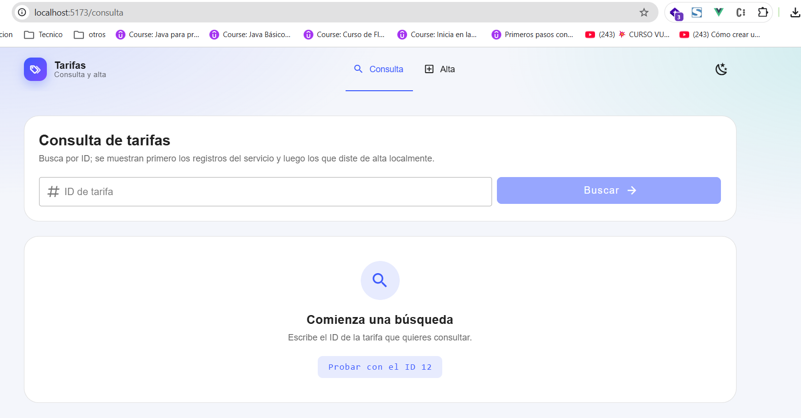
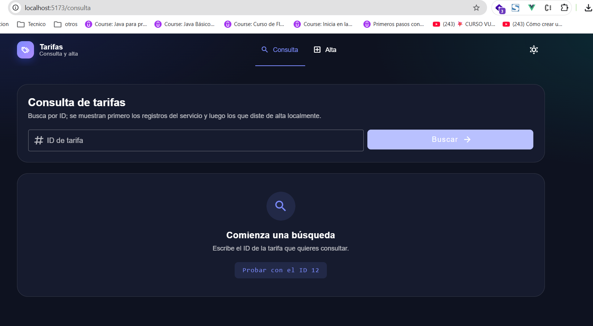
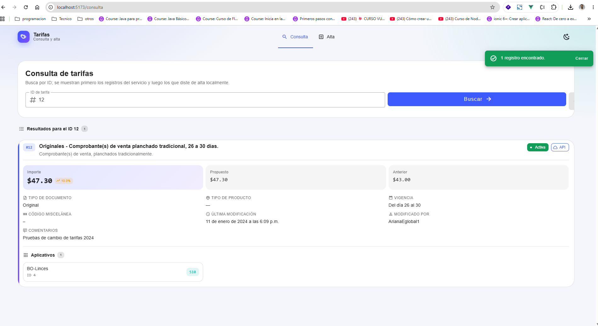
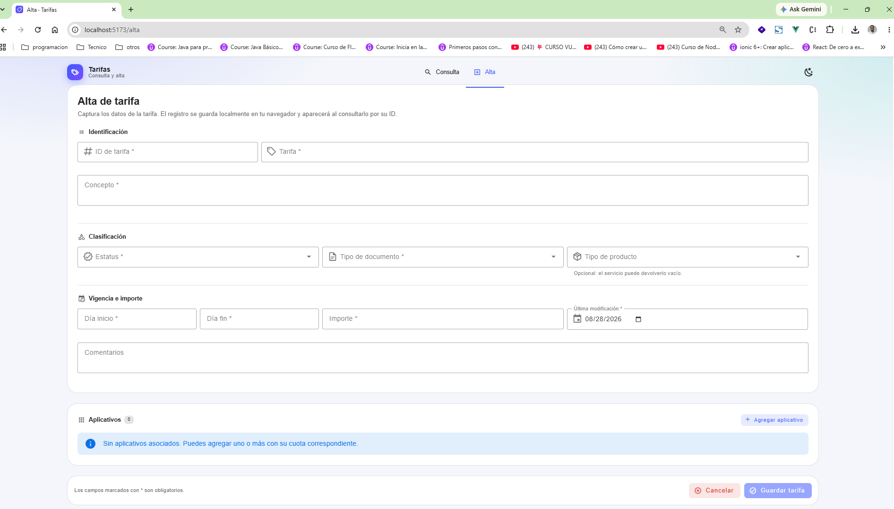
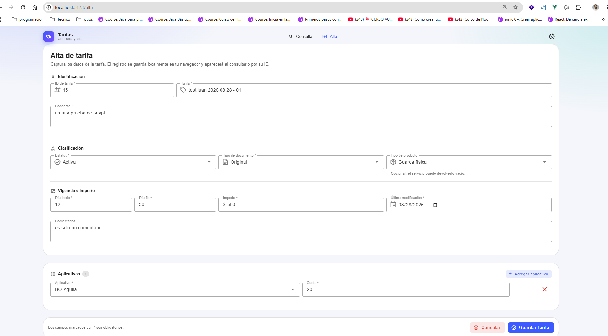
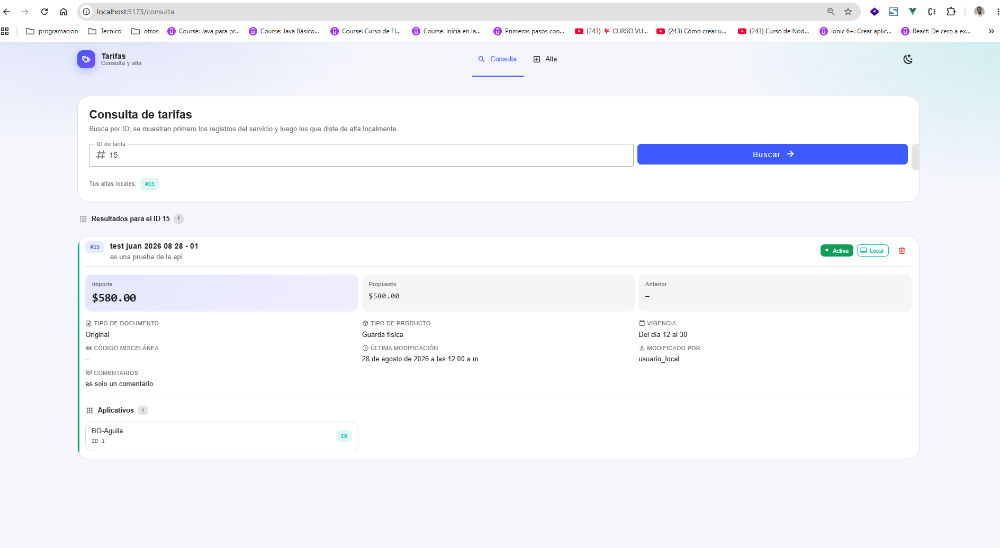

# Tarifas · Consulta y Alta

Prueba técnica Front-end: SPA en **Vue 3.5 + Vuetify 3 + TypeScript (Vite)** que consume el
endpoint de tarifas, muestra el detalle organizado y permite dar de alta registros locales.

La aplicación está pensada para ejecutarse **siempre dentro de Docker**, con hot-reload (HMR)
sobre el código del host.

---

## Requisitos

- Docker Desktop 24+ (incluye `docker compose` v2)
- No se necesita Node ni npm instalados en la máquina: el toolchain vive en la imagen
  (`node:24-alpine`).

## Levantar el entorno de desarrollo (hot-reload)

```bash
docker compose up --build
```

La app queda disponible en **http://localhost:5173**

Para dejarlo en segundo plano y ver los logs por separado:

```bash
docker compose up -d --build
docker compose logs -f web
```

Detener y limpiar:

```bash
docker compose down          # detiene los contenedores
docker compose down -v       # además borra el volumen de node_modules
```

### Cómo funciona el hot-reload

| Pieza | Rol |
| --- | --- |
| `.:/app` (bind mount) | El código del host se ve dentro del contenedor en tiempo real. |
| `/app/node_modules` (volumen anónimo) | Evita que el `node_modules` del host (binarios Windows/macOS) pise el del contenedor (Linux). |
| `server.watch.usePolling` en `vite.config.ts` | Los eventos `inotify` no cruzan los bind mounts de Docker Desktop; el polling garantiza que Vite detecte los cambios. |
| `server.host: true` | Expone el dev server en `0.0.0.0` para que el puerto publicado sea alcanzable desde el host. |

Al guardar cualquier `.vue`, `.ts` o `.scss` el navegador se actualiza solo, sin reconstruir la
imagen. **Solo hay que reconstruir (`--build`) cuando cambian `package.json` /
`package-lock.json`.**

### Instalar una dependencia nueva

```bash
docker compose exec web npm install <paquete>
docker compose up -d --build web   # persiste el cambio en la imagen
```

### Otros comandos dentro del contenedor

```bash
docker compose exec web npm run type-check   # TypeScript (vue-tsc)
docker compose exec web npm run build        # build de producción
docker compose exec web sh                   # shell interactiva
```

## Build de producción (nginx)

```bash
docker compose --profile prod up --build web-prod
# → http://localhost:8080
```

Imagen multi-stage: `node:24-alpine` compila y `nginx-unprivileged` sirve el estático. El runtime
corre sin root y escucha en el puerto 8080, compatible con los *security context constraints*
restringidos de **OpenShift**.

## Variables de entorno

Copiar `.env.example` a `.env` si se quiere apuntar a otro backend:

| Variable | Default | Descripción |
| --- | --- | --- |
| `VITE_API_BASE_URL` | `/api` | Prefijo que usa el cliente HTTP del front. |
| `VITE_API_TARGET` | `https://ebind-dev.egl-cloud.com` | Host real al que reenvía el proxy. |
| `APP_PORT` | `5173` | Puerto publicado en el host para desarrollo. |
| `APP_PROD_PORT` | `8080` | Puerto publicado en el host para la imagen de producción. |

### Sobre el proxy `/api`

El endpoint de origen no habilita CORS para `localhost`, así que el front **nunca** lo llama
directo: siempre pide a `/api/...` y quien reenvía es el dev server (desarrollo) o nginx
(producción). El mismo contrato en ambos entornos evita código condicional en el cliente y deja
el punto natural para inyectar cabeceras de autenticación del lado servidor.

Endpoint consumido:

```http
POST https://ebind-dev.egl-cloud.com/dgs-api-bridge/tarifas/consulta
Content-Type: application/json

{ "idTarifa": "12" }
```

## Estructura del proyecto

```
docker/            Dockerfile.dev (HMR), Dockerfile (prod multi-stage), nginx.conf
screenshot-prueba/ Evidencia visual de la aplicación funcionando
src/
  components/      Componentes de presentación reutilizables
  plugins/         Configuración de Vuetify (tema, iconos, defaults)
  router/          Rutas de las vistas Consulta y Alta
  services/        Cliente HTTP y servicios de dominio (capa de API aislada)
  stores/          Estado con Pinia (tarifas locales, notificaciones)
  types/           Contratos TypeScript del dominio
  views/           Vistas de Consulta y Alta
```

## Flujo de trabajo Git (Git Flow)

- `master` — releases estables.
- `develop` — rama de integración; todas las features se mezclan aquí vía PR.
- `feature/*` — una rama por incremento funcional, con PR hacia `develop`.

Commits en formato [Conventional Commits](https://www.conventionalcommits.org/)
(`feat`, `fix`, `chore`, `docs`, `refactor`).

---

## Evidencia de funcionamiento

Capturas tomadas de la aplicación corriendo en el contenedor de desarrollo
(`http://localhost:5173`), consumiendo el endpoint real.

### 1. Consulta — estado inicial



Pantalla de entrada con las pestañas **Consulta / Alta**, el buscador por ID y un estado vacío
que ofrece un atajo para probar directamente con el ID 12.

### 2. Consulta — tema oscuro



El conmutador de la esquina superior derecha alterna entre tema claro y oscuro; la preferencia
se recuerda entre sesiones y respeta la configuración del sistema en el primer arranque.

### 3. Consulta — resultado del API



Búsqueda del ID `12` contra `POST /dgs-api-bridge/tarifas/consulta`. Se muestra la
confirmación emergente («1 registro encontrado»), el bloque destacado de importes con la
variación respecto al importe anterior (+10.0 %), los catálogos (estatus, tipo de documento),
la vigencia, los metadatos de última modificación y los aplicativos con su cuota. La etiqueta
**API** identifica el origen del registro.

### 4. Alta — formulario vacío



Formulario organizado en secciones, con los campos obligatorios marcados, la fecha de última
modificación precargada al día actual y la barra de acciones fija al pie.

### 5. Alta — captura completa



Registro capturado con todos los campos del contrato del API, incluido un aplicativo con su
cuota. Las validaciones cubren obligatoriedad, ID numérico no duplicado, días entre 1 y 31 con
fin ≥ inicio, importe con máximo dos decimales y fecha no futura.

### 6. Consulta — registro dado de alta localmente



Al guardar, la app redirige a la consulta con el ID ya buscado. El registro local se presenta
con el mismo formato que los del servicio pero etiquetado como **Local** (y con opción de
eliminarlo); los ID guardados quedan accesibles como atajos en «Tus altas locales». Cuando un
ID existe en ambos orígenes, los registros del API se listan primero.
